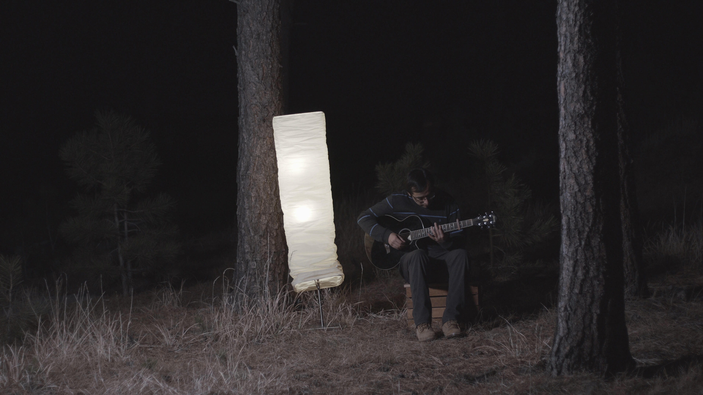

2017 turned out to be quite the year for me. Lots of big changes, and lots of attempts at living a more balanced, artful life. After spending five years at CU Boulder, I'm happy to finally be done with school forever. Academia was never my forte, and I was anxious to be done with it all. Looking back, I kinda miss those days.. and it hasn't even been 6 months. But you always miss the days when they're gone. It's hard to appreciate the good times while you're living them.

_My old room. Good memories here._

In the midst of trying to finish school on a scramble, I was desperately looking for a full time job. I had a few years of experience, so I didn't think I'd run into trouble finding jobs. Turns out, it's very difficult to find a job that excites you, and at the same time wants to hire you. I struggled to find that combo, and it took me precisely 43 job interviews, only 2 of which turned into legitimate offers. Now, I'm makin' stuff at [Viget](http://viget.com), a full-service interactive agency that specializes in custom software and hardware. It's been such a trip working with really talented people, and I'm excited to see where my journey with Viget leads to.

I've had the chance to make some really cool stuff at Viget. Technology-wise, I'm heavily exploring JavaScript and React. Those two technologies seem to have had far-reaching implications in the world of software and I'm psyched to be living at such an exciting time for programmers. A few years back when I decided that I wanted to become a web programmer, I promised myself that I would make art out of it. I'm fortunate that Viget let me do such things and let me spearhead our WebVR development.

Amongst all the job hunting and academic struggles, I tried to squeeze music in there once in a while when inspiration hit, but I've kinda been at a wall for a very long time. All the chaos in life does amount to some relatively interesting riffs on the guitar, but I've never been able to take those fragments and compose them into full-fledged songs. They now live as tiny bits of music that I've very sporadically managed to lay down between everything else in life. Makes sense, because music has not really been a priority for me for the past few years. The pressure of school and money combined made it very easy to put music on the backburner.

_One of the videos I did manage to make with my music buddy Sam Martin. Scope it [here](https://www.youtube.com/watch?v=DwvlEhy5q5Y)!_

But, things are swinging back to the way they used to be. Now that I have no commitments outside of work, it's been much easier to allocate time for music. The electro-acoustic stuff that [I used to upload on SoundCloud](http://soundcloud.com/effulgence) is less of a priority now, and I'm honestly focusing on honing my chops on the guitar before going back to the computer. I've got two new videos on YouTube currently, both made by my good friend Ben Crawford. One is about [why I do what I do](https://www.youtube.com/watch?v=UHDN-TyN92U), and the other, [a 60 second fingerstyle cover of The Scientist by Coldplay](https://www.youtube.com/watch?v=2PNG4Nei8CI).

_Just a nerd and his guitar in the middle of a forest in Flagstaff, Boulder. It was very cold._

Aside from music and work, I also had the chance to travel around the states a bit more. That's been really nice, because ever since [Argentina](http://prayash.io/blog/undiscovered-colors), I've had the itch to visit new, unfamiliar places. This year, I got to visit New Mexico, New York City, Boston, Washington DC, and Durham, NC. Not the most extensive list, but I really enjoyed them. I'm definitely looking forward to spending the next year traveling to some awesome places. It's always really inspiring to travel to new places and come back with new inspiration. I've found that to be very helpful when looking for inspiration in art.

_Playing around with the Microsoft HoloLens at MIT. A revolutionary piece of technology._

Aside from work, music and traveling, life could not be more exciting.
