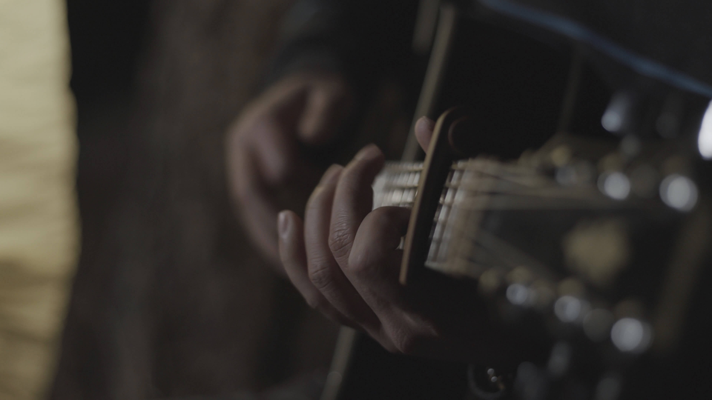
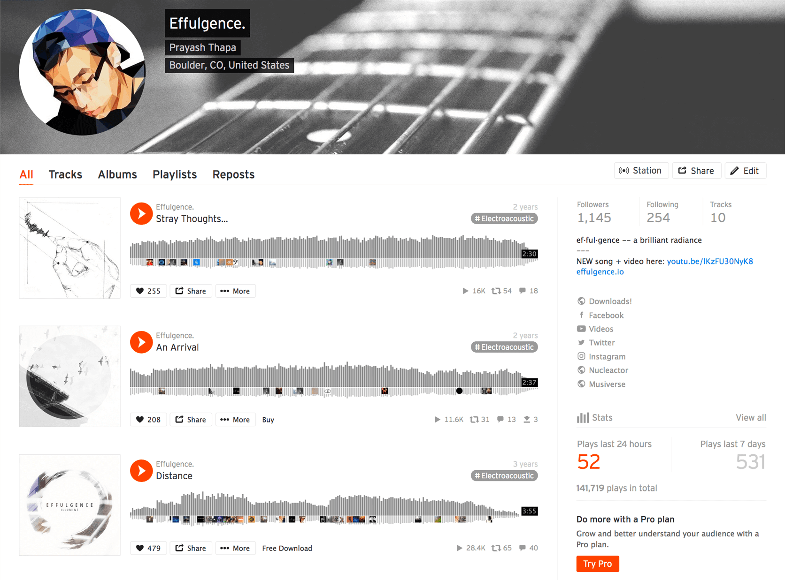
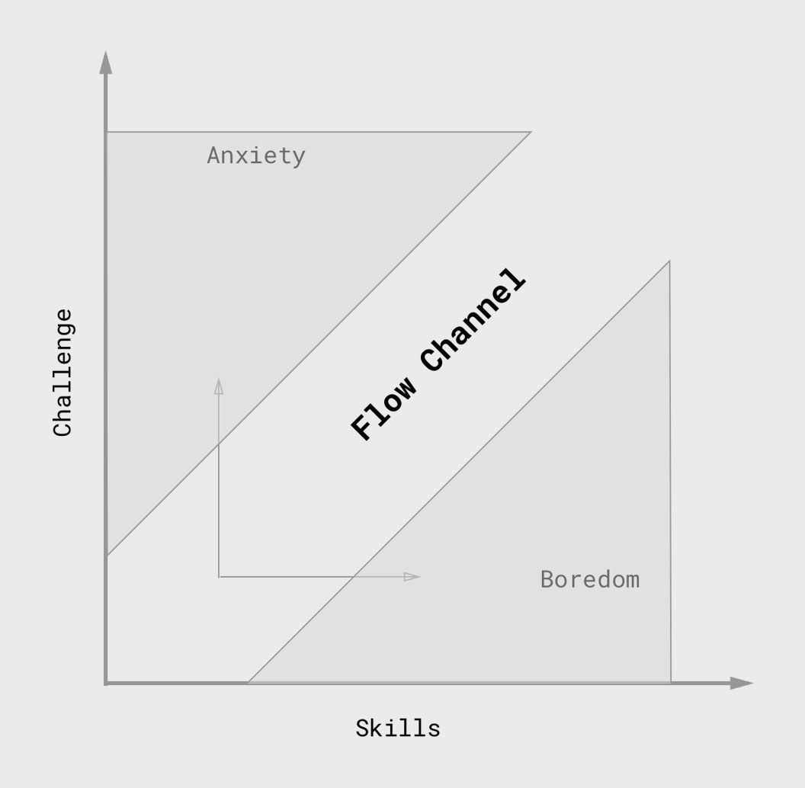
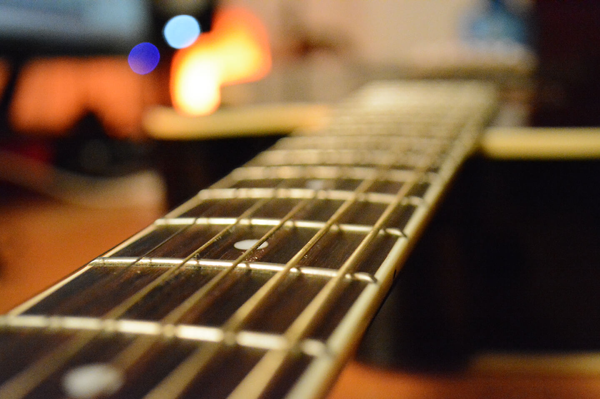
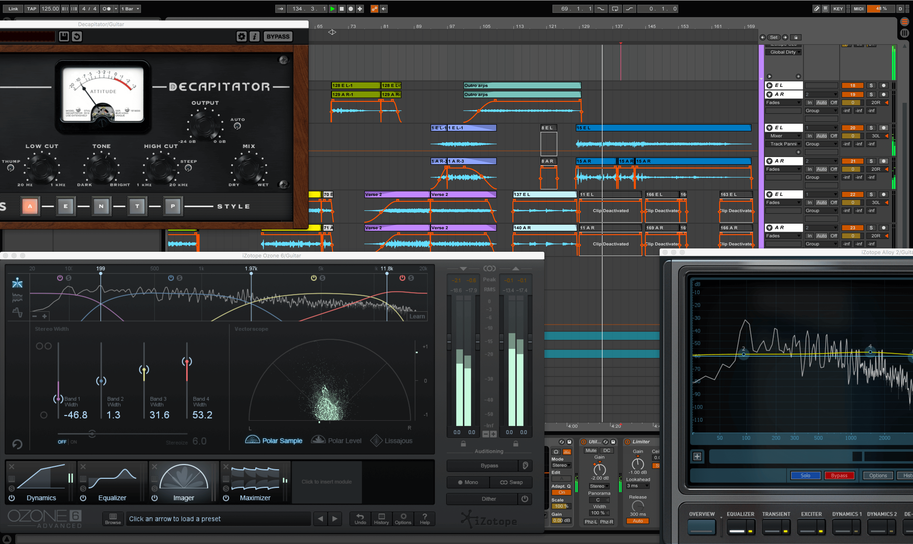

_Note: This blog post was born out a presentation I did during a weekly company lunch at [Viget](https://viget.com). Feel free to check out the [slides](http://prayash.io/labshare) and a [recording of the presentation](https://www.dropbox.com/s/x5sk2b5dspwxvze/LabShare-Prayash-2018-02-16.mp4?dl=0)._

---

Music has always been a sacred activity for me, a place for me to really explore another world. A world where my mood, my experiences, my identity, and every bit of who I am can actually crystallize into something tangible: sound. When all seemed to go wrong with the world, I've always been able retreat to music as my sanctuary.

 

 

It all started with the guitar, and for me [it's always been about the guitar](https://www.youtube.com/watch?v=UHDN-TyN92U). Acoustic guitar, specifically. In the music that I make, the guitar has always been the driving force regardless of all the other elements that surround it, whether that be synths, or strings, or vocals, or percussion. I remember when I was 11 back in Nepal, and I heard my uncle strumming the chords to Hotel California, so I asked him to teach me a few chords, and the rest is history. For a pretty significant chunk of my life, nothing else really existed for me in this world. I never pursued music formally so it's all been a huge experiment. But my love for music has driven me to pursue it in a slightly obsessive way. From acoustically treating my room, to investing in a bunch of gear, and experimenting with all these different aspects of music like composing, producing and recording has been an absolute joy, and a form of therapy and medicine for me. Exploring this craft of bedroom musicianship in the midst of school, life, and work has been challenging undertaking of mine for the past several years. It's provided me with this medium to explore my own imagination and bring these musical ideas in my head to life, and to try to add something to the musical collective – to figure out what it means to have my own creative fingerprint.

 

 

It all started with sharing my work on the Internet, which has been really inspiring. Starting with [SoundCloud](https://soundcloud.com/effulgence) way back when it was actually a vibrant community of like-minded musicians giving each other feedback on how we could improve our tunes, which seems to no longer be the case, to now uploading videos to [YouTube](https://www.youtube.com/results?search_query=effulgence+music&page=&utm_source=opensearch).

I've learned a lot over the years, and the nice thing is that these lessons are applicable to many other aspects of my life, even software. And one could easily gather these lessons from any creative pursuit, whether that be dancing or painting, it's just that music has been the primary medium of self-expression for me, so that's what I'll focus on.

 

#### Zen mind, beginner's mind.

"In the beginner's mind there are many possibilities, in the expert's mind there are few." - Shunryu Suzuki

There's a great book called [Zen Mind, Beginner's Mind](http://a.co/2jFZS80) that explores the idea of approaching a craft as if you were a beginner, because that sense of blissful ignorance and that childlike naiveté is really important to creativity. It elevates the act itself and it makes it so enjoyable. To let go of your own standards and expectations and transcend them and just engage in the art itself is key.

And the style of guitar that I play (fingerstyle guitar) is really an anomaly because I'm trying to utilize every part of the guitar – not just the strings. I'm slapping different parts of the body to create percussive sounds, and I'm also whacking the fretboard to create these slap harmonics, to playing over the neck so I can play a bassline with the left hand and do some percussive and lead with the right hand using a variety of techniques like tapping and hammer-ons. And something really weird, and kind of annoying sometimes about this style is the myriad of tunings that I end up using achieve different sounds. For those of you that are guitar nerds you can see that some of them are quite bizarre but they help me achieve what's not possible with a standard tuned guitar. But it's really about taking a fresh approach to the guitar. I really enjoy starting a song fresh in a different tuning and approaching it without any preliminary knowledge. I find that it helps me be more creative and more inspired because it forces me to break out of my own habits and patterns. And it leads to some really interesting problem solving and happy accidents that I find to be really beneficial to the creative process, and to keep the juices flowing.

 

#### The Flow State is the High We All Chase

The state of Flow is one of the best things about doing the work that we love. It's pure magic. It's the high we all chase. That moment when I am so deeply engrossed in the act of making music that the world around me vanishes. It almost feels like it's not even _me_ making music. It's as if I'm a vehicle or a channel for something else to come through that's really beyond me, and I simply need to open myself up to it. I look back at some of the music I've made and I can't remember making the melodies or writing those chords. It feels like a total blur.

This chart really speaks to me, and I think to many of you as well. The balance between anxiety and boredom is so important to falling into the flow state where the level of challenge and the level of skill are just right to facilitate growth and also to make the work rewarding. I think it's really important to have a place where we can fall into this state easily, as that's where we do our best work.

 

#### The Dance of Problem Solving & Creativity

Making music is equal parts art and engineering. On one hand, we have the composition phase, where the sole purpose is to string together (pun intended) a bunch discrete ideas into a singular composition and to create a cohesive piece of music. For me, obviously, that's going to be reaching for the guitar as that's the most immediate extension of all my musical ideas.

 

 

But then, there's the science of it all. There's so many technicalities that come to surface when I'm in the stage of fleshing out an arrangement. I need to make sure that other instruments aren't clashing with each other and that each sound is occupying its own space in the frequency spectrum. I need to make sure the dynamic range of the song is appropriate and matches the energy levels. I need to tune the stereo image just right so that in the audio plane everything is sitting where it should. For example, higher pitched sounds should usually be distributed whereas lower pitched ones need to stay centered. And I need to make sure the sound is consistent across multiple sound systems and sounds as close as possible to what I'm hearing through my own speakers.

 

 

And all this stuff is fascinating. Recording, producing, mixing, mastering are all arts of their own and I've merely scratched the surface of each. But it's so easy to get lost in the minute details during the process that losing the big picture is really easy. Writer's block is one of the most common problems I run into, and I find it absolutely debilitating. I highly recommend the book The War of Art by Stephen Pressfield who talks about some of this. And one tactical way to battle writer's block is to use Oblique Strategies by Brian Eno.

 

#### Simplicity is the Ultimate Sophistication

Sticking to the core idea is difficult when there are a million variables that I can play with at any given moment. And this reminds of a common saying by one of the greatest computer scientists of all time who says that premature optimization is the root of all evil.

I find that this is true in music where I just get stuck in a loop and an idea that was initially really inspiring can become stale very quickly if I get bogged down by the details of it too early during the writing process. Especially with such advanced music technology, it's so easy to switch gears all the time and lose focus from the task at hand. So I usually just write the song as a solo guitar piece before moving it into the computer, and that seems to help a lot.

 

#### Everything is a Remix

All original ideas are [variations of pre-existing ones](https://vimeo.com/139094998). I recycle musical ideas all the time. Any act of music-making at this point is a re-hash of something that's already been done. [Will we ever run out of new music?](https://www.youtube.com/watch?v=DAcjV60RnRw) No, not for a very long time.

There's no need to reinvent the wheel every time. We all stand on the shoulders of giants. In the same way that programmers reach for that library or framework that already solves our problem, I never hesitate to reuse a chord progression, motif or a scale that I've heard or used before.

"Nothing is original. Steal from anywhere that resonates with inspiration or fuels your imagination. Devour old films, new films, music, books, paintings, photographs, poems, dreams, random conversations, architecture, bridges, street signs, trees, clouds, bodies of water, light and shadows. Select only things to steal from that speak directly to your soul. If you do this, your work (and theft) will be authentic. Authenticity is invaluable; originality is nonexistent. And don’t bother concealing your thievery. celebrate it if you feel like it. In any case, always remember what Jean-Luc Godard said: “It’s not where you take things from – it’s where you take them to.” – Jim Jarmusch

I really love the ending of this quote and to me it's about creating an output that is an amalgamation of all the things that inspire and influence me as an artist and taking all of that and putting my own spin on it to achieve that degree of authenticity. It's the creative fingerprint that I mentioned earlier.

#### "Art is never finished, only abandoned." - Leonardo da Vinci
