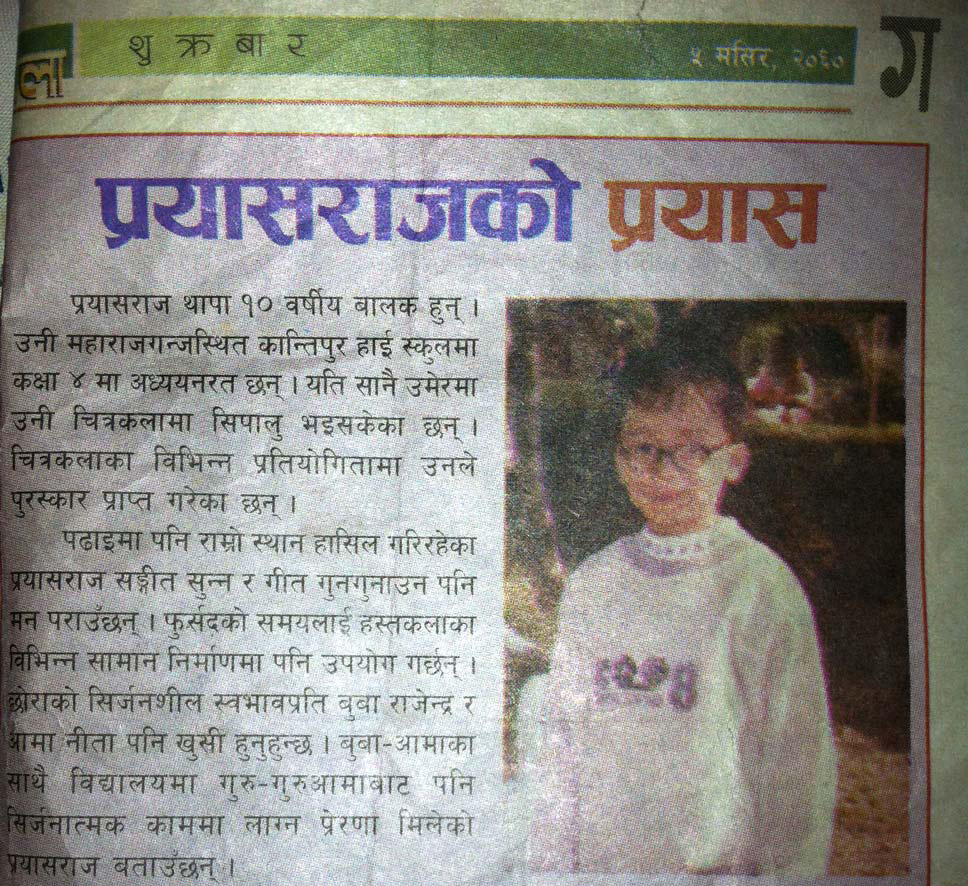
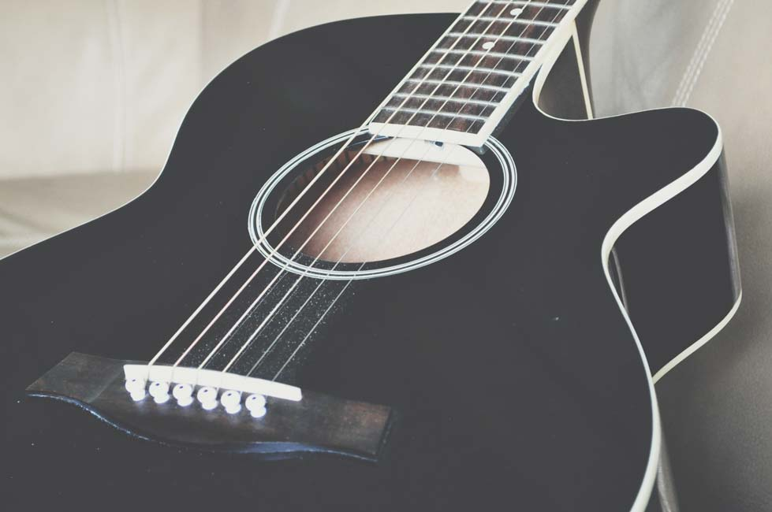
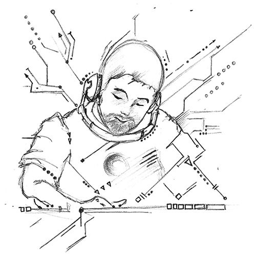
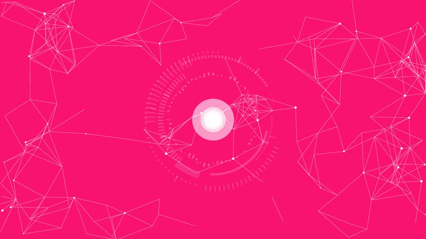

My journey in art began when I was 7 years old. At that time, I was living in [Kathmandu, Nepal](https://goo.gl/maps/dRHoHcJc5WJ2) (where I was born). My father bought me a water color set and some paint brushes for my birthday. I was hooked. Painting brought so much color to my life, literally. I looked forward to getting home from school every day so I could go crazy on the back pages of my school notebook. The nuances of the paint brush taught me a lot. It forced me to loosen my hands up and to avoid being stiff, and in many ways that taught me a lot about life. At some point, I got a set of color pencils and started outlining my paintings with them. That's when drawing started to take precedence over painting. It was a nice break from all the splatter. I started being precise and bold with each stroke. It was the perfectly opposite thing for me to learn. I was so into it that I even got published on the local newspaper!

_Look ma, that's me! The title literally translates to 'Prayash's Prayash.' My name means attempt. So, I guess it's an eloquent way of saying 'The attempt of Attempt.'_

The sad part is, they never published the actual drawing. Just a profile on me.. lame. But, the validation felt assuring, and I promised myself to push farther and harder. But my dedication actually waned.

Fast forward to 11 years old when I heard my uncle strum the chords of [_Hotel California_](https://www.youtube.com/watch?v=BYlb_MnOhBs) in the other room. I walked over to see a massive dreadnought guitar in his embrace. There was something about those steel strings ringing together that caught my attention. Seeing my curious face, he generously offered to teach me a few chords. I learned the typical G -> D -> C progression while he sang _Knockin on Heaven's Door_. That felt so good. I was hooked! I couldn't put the guitar down after that.

_My first guitar that I bought in 2013, and still play to this day._

I kept creating the occasional drawing or two in high school year, and art class was definitely the one I looked forward to the most. My teacher was amazing and encouraged me to pursue it in college, and so I did. I admitted into college as a Studio Art major with an emphasis on drawing and painting, I loved every bit of it. It felt like I was re-discovering my 7 year old self.

_I was obsessed with the freehanded geometric aesthetic. This was a tribute to [Nujabes](https://youtu.be/WrO9PTpuSSs?t=7m50s), a jazz-hop legend._

Sometime around my second year in college, I decided to enroll in an introductory programming course. I had always been the computer nerd in my family, so I thought why not? The bulky white box that dad brought home with a Windows 95 disc had me so engaged when I was a child, so I saw no harm in trying out something new. I learned programming by writing super basic programs and text-based games. One lecture specifically caught my attention: [Cellular Automata](https://en.wikipedia.org/wiki/Cellular_automaton). Seeing a bunch of random pixels interact with their on-screen neighbors consciously based on a few basic rules lit up a different part of my brain. Such a simple algorithm with such an entrancing visual. Maybe I can still draw and paint, but use code as my brush?

Well, no doubt. That's when I stumbled down the rabbit hole of Computer Graphics. The revelation that I could still creatively express myself through code and make beautiful things turned my world upside down. It was the perfect definition of lazy man's art. I define a simple set of constraints and let the computer pseudo-randomly run wild, yet somehow it can still produce something impressively artistic while I sit back and watch? Mind = blown.

_[Nucleactor](http://effulgence.io/Nucleactor), an audio-visualizer I coded during a hackathon._

So there it was, all in front of me. Music, visual art, and code. It was the definition of a holy trinity. The perfect blend of three worlds combined into one beautiful melting pot of logic and creativity. Nothing could be more perfect. At that point, I realized that this is what I want to do for the rest of my life: Art.
