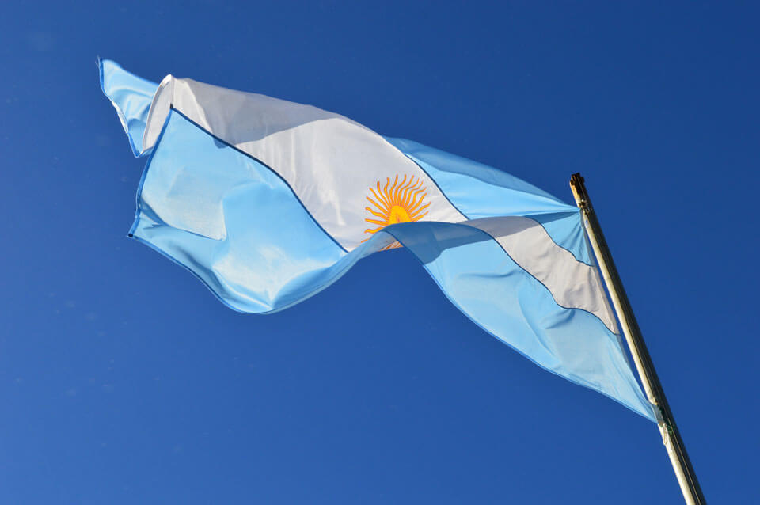
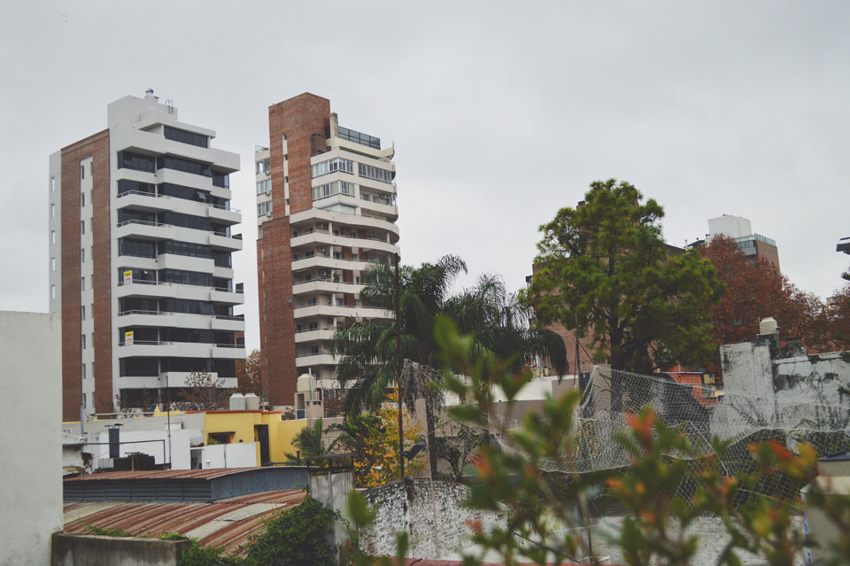
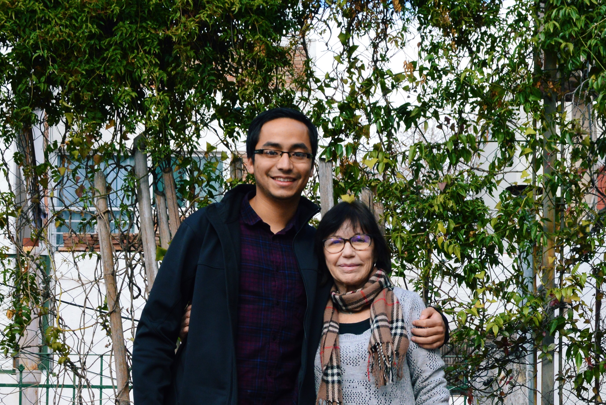
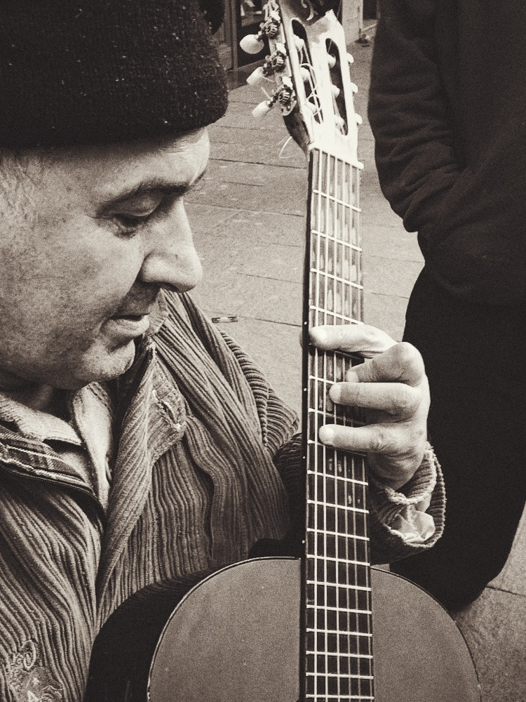
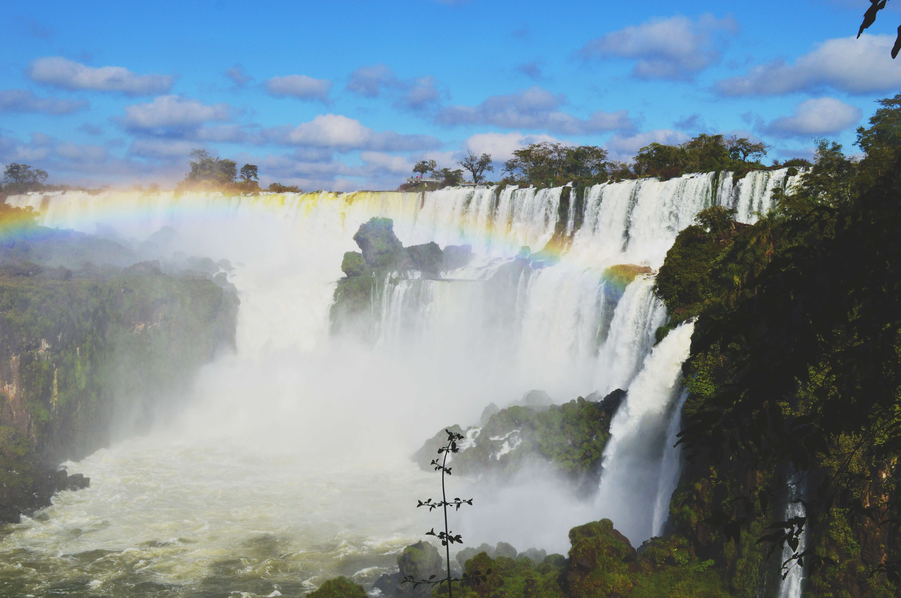
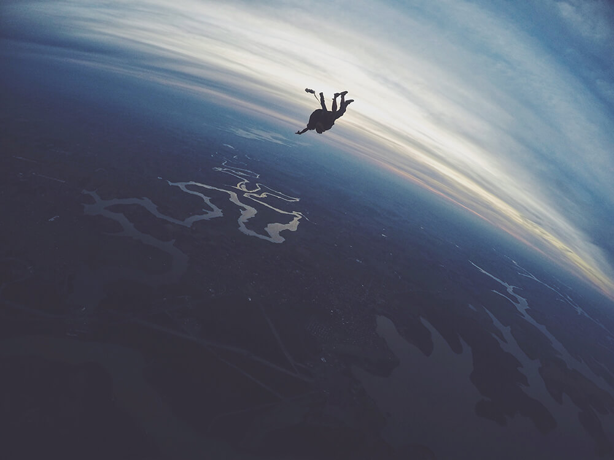
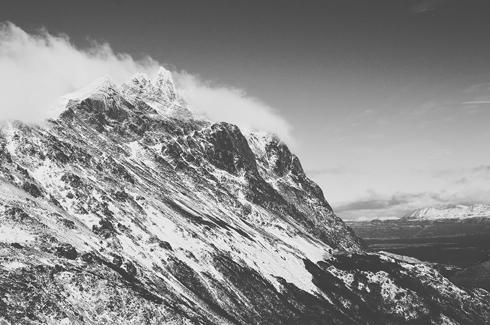
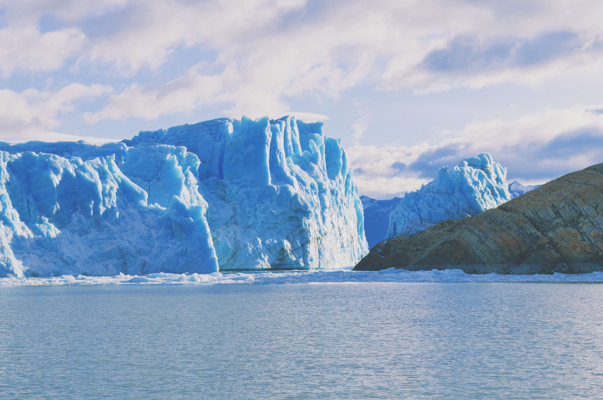
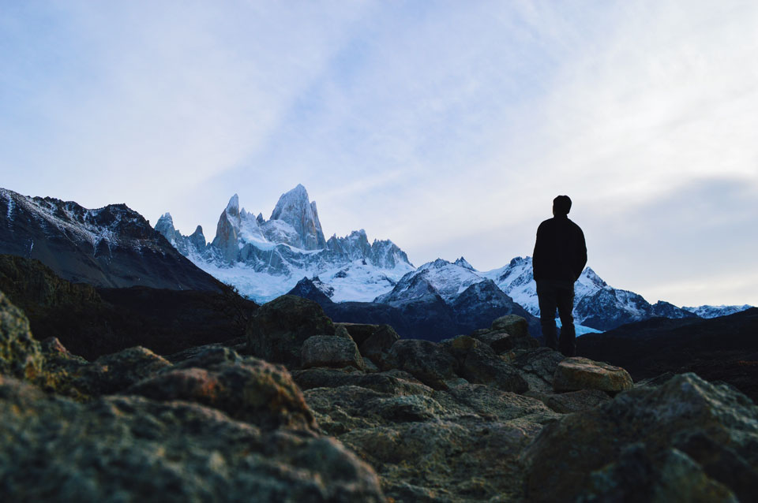

The summer preceding my last year of college, I decided to study abroad in a Spanish-speaking country. I had been formally studying the language since high school and my ultimate goal was to cap it all off with a immersive experience somehwere in Latin America. I always heard great things about Argentina, and after being exposed to Argentine films and music, it left a lasting impression on me. I enrolled in a program through my school and off I went to Rosario for two months to study Argentine literature, history and culture.

_The national flag at [Iguazú](http://whc.unesco.org/en/list/303)._

My host-mom because she turned out to be the most affectionate host-mother I could've ever asked for. We developed an incredibly strong bond, and every single night of dinner consisted of lively conversations spanning a variety of topics ranging from adversity, love, family, dreams, tragedy, politics, history, consciousness and spirituality amongst other things. To this day, I keep in touch with her and we call each other at least a few times each year to see how we're doing. I think I would definitely like to go back and visit her in a few years. I know I've got a home in Rosario now.

_The view from the patio._

_Me and my madre Argentina, cheesin' on the day of my departure._

Rosario was a beautiful city to study in. It's rich in history and culture, and the nightlife is booming. I made some great friends and had a lot of fun exploring the city. My favorite activities were boating across the river, learning tango, going clubbing with friends, pigging out on amazing steak dinners, drinking yerba maté by the river, and generally exploring the lesser known nooks and crannies of the city.

_A street musician strumming some beautiful chords to an italian love song._

Not to mention the quick trip north to Brazil for a nice weekend at Puerto Iguázu, named after the incredible waterfall called Las Cataratas del Iguázu.

_Yes, such a thing exists in this planet. Brazil is otherworldly._

_Skydiving over La Triple Frontera in Brazil._

Shortly after the academic program ended, I seriously had not had enough of this place. I itched to explore more. So I booked a solo trip to Patagonia and decided that I would go on a solo viaje to the south. Along the way, I came across some of the most beautiful landscapes I've ever encountered.

Behold the Beagle Channel in Ushuaia, the southernmost city of the world. First up on the list was a 4x4 drive through the Patagonian forests.

_We spent hours driving through dense forests until we came out to a lakeside beach. It had this beautiful panorama of mountains along the lake._

Next up was taking a helicopter ride through the Andes. That was a breathtaking experience.

_The pilot offered us a bottle of champagne at the top of the mountain. The elevation made for a nice buzz._

_The pilot offered us a bottle of champagne at the top of the mountain. The elevation made for a nice buzz._

I would be remiss if I didn't mention the epic glaciers en route to El Chálten, the trekking capital of Argentina:

_These tall glaciers made the most reverberating crackles through the national park._

And at last...

_The majestic Cerro Fitz Roy. I could stare at this thing all day long. And I did._

Exploring all these new places by myself taught me countless things. I think developing that sense of peace with yourself and enjoying your own company is so important to living a fulfilled life. For me, it became a time for a lot of self reflection and re-evaluation. It taught me to be present and always follow the path of spontaniety. More importantly, it taught me how to see color that already exists in my life. It made me appreciate my own culture, my own upbringing, my daily routine, my friends, family and loved ones. I ended up missing all those things after being alone for a while. All the things I loved to do that once seemed mundane and ordinary all of a sudden extraordinary when I distanced myself from it. I felt like I was discovering new colors in my own life after being exposed to vastly new and fresh experiences.

Traveling can have such profound effects on one's sense of self-confidence and satisfaction with the world. In the end, we're all humans and borders are only man-made constructs. We all operate under the same laws of human nature and so instrinsically, that human connection is always there waiting to be felt regardless of skin color, belief systems, or nationalistic pride.
